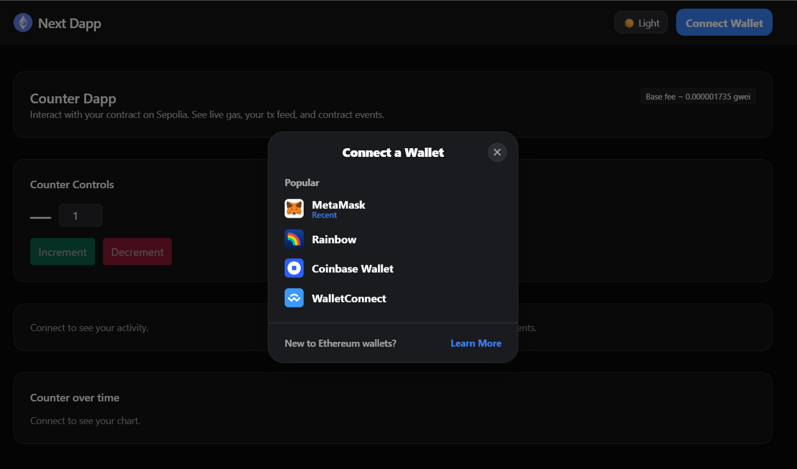
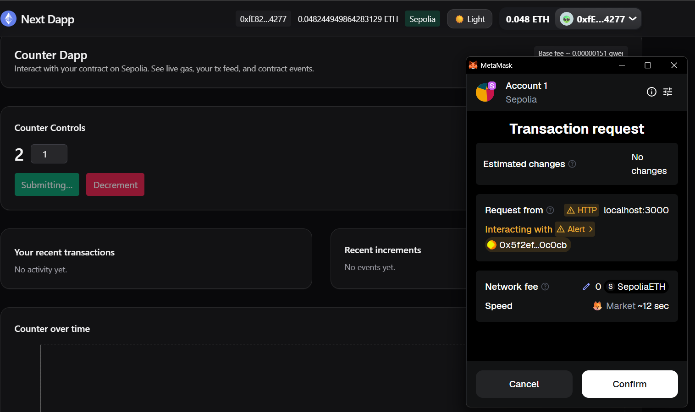
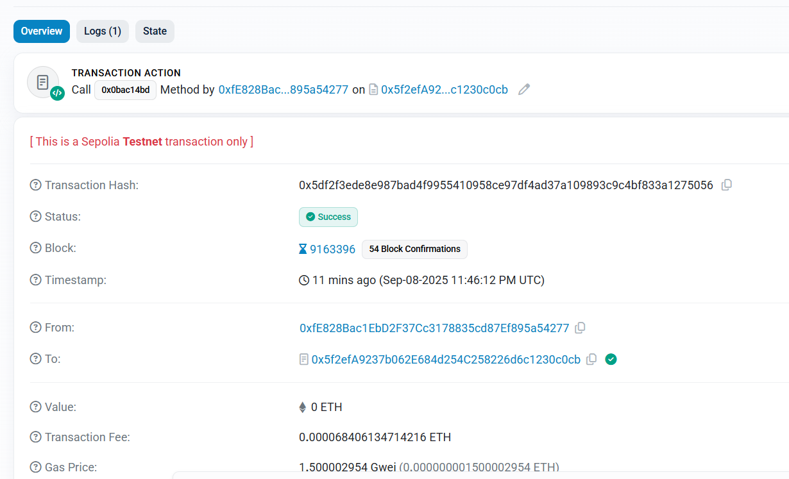
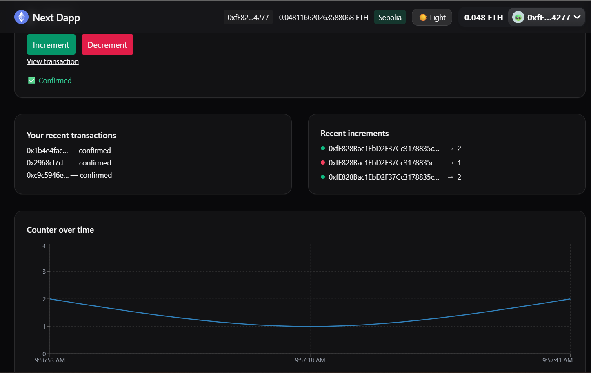

# ⚡ Next Dapp – Web3 Counter on Sepolia

A simple decentralized application (dApp) built with **Next.js 15**, **RainbowKit**, **Wagmi**, and **Hardhat**, deployed on the **Sepolia Testnet**.  
The app demonstrates wallet connection, smart contract interaction (increment/decrement counter), live transaction feed, and data visualization.

---

## ✨ Features

- 🔐 **Wallet connection** with MetaMask, Rainbow, Coinbase Wallet, WalletConnect via RainbowKit.
- 🔄 **Smart contract interaction** – increment & decrement a counter stored on-chain.
- 🧾 **Transaction feed** – view recent transactions and confirmations.
- 📊 **Counter chart** – see counter values plotted over time.
- 🌗 **Dark/Light mode** toggle.
- 🎨 Clean, responsive UI styled with TailwindCSS.

---

## 🖼️ Screenshots

### Wallet Connection


### Sending Transaction


### Confirmed on Sepolia


### Dark Mode UI


### Light Mode UI


*(All screenshots from local development connected to Sepolia Testnet)*

---

## ⚙️ Dependencies

### Frontend
- [Next.js 15](https://nextjs.org/) – React framework
- [RainbowKit](https://www.rainbowkit.com/) – wallet connection UI
- [Wagmi](https://wagmi.sh/) – React hooks for Ethereum
- [Viem](https://viem.sh/) – lightweight Ethereum client
- [Tailwind CSS](https://tailwindcss.com/) – styling
- [Next Themes](https://github.com/pacocoursey/next-themes) – dark/light mode
- [Recharts](https://recharts.org/en-US/) – charting

### Smart Contracts
- [Hardhat](https://hardhat.org/) – development & testing framework
- [Ethers.js](https://docs.ethers.io/) – contract deployment/interactions
- Solidity (Counter.sol)

---

## 📦 Installation

Clone the repo and install dependencies:

```bash
git clone https://github.com/your-username/next-dapp.git
cd next-dapp
npm install

🔑 Environment Setup

Create a .env file in the root:

ALCHEMY_SEPOLIA_URL=https://eth-sepolia.g.alchemy.com/v2/yourAlchemyKey
PRIVATE_KEY=0xyourPrivateKey
NEXT_PUBLIC_COUNTER_ADDRESS=0xDeployedContractAddress
NEXT_PUBLIC_ALCHEMY_SEPOLIA_URL=https://eth-sepolia.g.alchemy.com/v2/yourAlchemyKey
NEXT_PUBLIC_WALLETCONNECT_PROJECT_ID=yourWalletConnectId
NEXT_PUBLIC_DEFAULT_CHAIN_ID=11155111

🛠️ Compile & Deploy Contract
npx hardhat compile
npx hardhat run scripts/deploy.ts --network sepolia

🚀 Run the App
npm run dev

App runs at http://localhost:3000

---

## ✅ Usage

Connect your wallet.

Choose Increment or Decrement to update the counter on-chain.

Watch transaction status update in the UI and on Etherscan.

Toggle Dark/Light mode as you prefer.

---